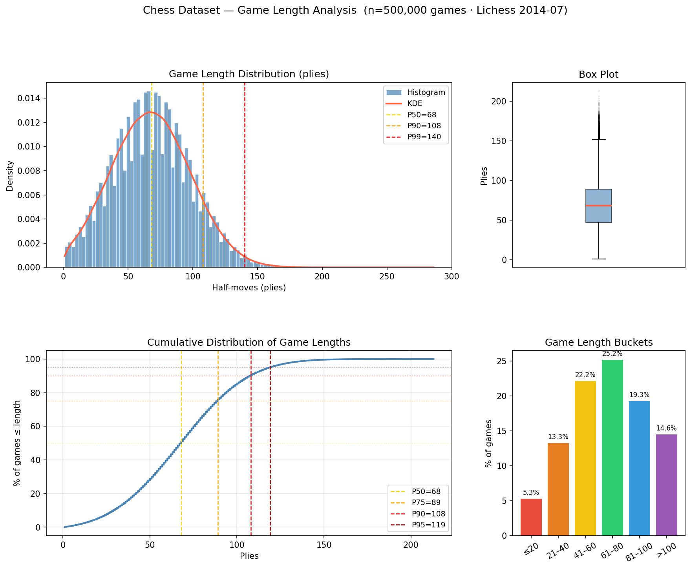
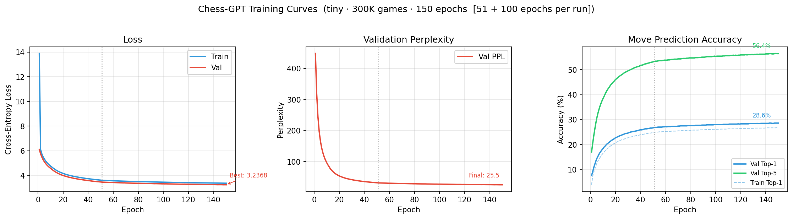
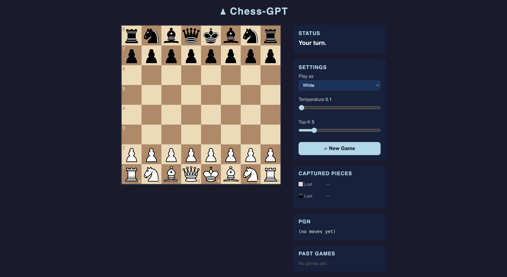

# Chess-GPT

A GPT-2 language model implemented and trained from scratch to play chess, with constrained decoding to guarantee legal moves at every step.

---

## Overview

Chess-GPT treats a chess game as a sequence of SAN (Standard Algebraic Notation) moves and trains a GPT-2 decoder to predict the next move given the game history. At inference time, **constrained decoding** masks all illegal moves to `-inf` before the softmax, so the model can never produce an illegal move.

---

## Project Structure

```
chess-gpt/
├── src/
│   ├── model/
│   │   ├── gpt.py            # GPT-2 implementation from scratch
│   │   ├── layers.py         # CausalSelfAttention, FeedForward, LayerNorm
│   │   └── config.py         # GPT2Config dataclass
│   ├── tokenizers/
│   │   └── move_tokenizer.py # MoveTokenizer — one token per SAN move
│   ├── inference.py          # load_chessgpt(), get_gpt_move()
│   └── logging_utils.py
├── train_chessgpt.py         # Training script
├── play_chessgpt.py          # FastAPI interactive chess app
├── artifacts/
│   ├── move_tok.pkl          # Trained tokenizer
│   ├── chessgpt_tiny_300k_best.pt
│   └── logs/
└── data/
```

---

## GPT-2 From Scratch

The model is a clean GPT-2 implementation in PyTorch — no HuggingFace, no external model libraries.

**Architecture** (`src/model/gpt.py`):

```
token_emb(vocab, d_model) + pos_emb(max_seq_len, d_model)
    → Dropout
    → N × GPTBlock
        · Pre-norm:  x = x + Attn(LayerNorm(x))
        · Pre-norm:  x = x + FFN(LayerNorm(x))
    → LayerNorm
    → lm_head  [weight-tied with token_emb]
```

- **Pre-norm residual** (as in GPT-2): layer norm applied before each sub-layer
- **Causal self-attention**: autoregressive mask, no cross-attention
- **Weight tying**: `lm_head.weight == token_emb.weight` — reduces parameters and improves perplexity

**`tiny` preset** (trained model):

| Hyperparameter   | Value  |
|------------------|--------|
| `d_model`        | 128    |
| `n_heads`        | 4      |
| `n_layers`       | 4      |
| `d_ff`           | 512    |
| `max_seq_len`    | 512    |
| `dropout`        | 0.1    |
| **Total params** | ~3.2M  |

---

## MoveTokenizer

`src/tokenizers/move_tokenizer.py` — a custom tokenizer where **each unique SAN move string is a single token**.

```
'e4'    → token 42
'Nf3'   → token 317
'O-O'   → token 1204
```

**Why not BPE?**  
BPE sub-word tokens break the 1-to-1 correspondence between tokens and moves. With `MoveTokenizer`, the token vocabulary aligns exactly with the set of legal SAN moves — enabling trivial constrained decoding at inference time.

**Vocabulary stats (chessgpt_tiny_300k):**

| Item              | Value  |
|-------------------|--------|
| Total vocab size  | 19,060 |
| Special tokens    | 4 (`<PAD>`, `<BOS>`, `<EOS>`, `<UNK>`) |
| PAD / BOS / EOS / UNK | 0 / 1 / 2 / 3 |

Move numbers (`1.`, `2.`, …) and game results (`1-0`, `0-1`, `1/2-1/2`) are stripped during tokenisation.

---

## Constrained Decoding

At inference time (`src/inference.py → get_gpt_move`):

1. Enumerate all legal moves for the current position via `python-chess`: `board.legal_moves`
2. Convert each to SAN and look up its token ID in the tokenizer
3. Build a **mask tensor** filled with `-inf`; set only legal move positions to their actual logits
4. Apply temperature scaling, optional top-K filtering, then `softmax` + `multinomial` sampling

```python
mask = torch.full_like(logits, float('-inf'))
mask[0, legal_ids] = logits[0, legal_ids]   # unmask only legal moves

probs      = torch.softmax(mask, dim=-1)
next_token = torch.multinomial(probs, num_samples=1)
```

This guarantees **100% legal move generation** — the model cannot physically sample an illegal move. A random-legal-move fallback handles the rare case where the sampled token has no valid SAN mapping.

---

## Minimax Search (`src/search.py`)

Beyond greedy sampling, Chess-GPT optionally runs **minimax search** over GPT-generated candidate moves. This is togglable from the UI — no retraining required.

### How it works

1. **Policy:** the GPT model ranks all legal moves by raw logit and returns the top-K as candidates (deterministic, no sampling)
2. **Search:** minimax with alpha-beta pruning expands the tree to a given depth, alternating between the model playing for both sides
3. **Evaluation:** leaf nodes are scored by **material balance** (centipawns: pawn=100, knight=320, bishop=330, rook=500, queen=900)
4. **Selection:** pick the root move whose worst-case opponent reply leaves the best material score

```python
# src/search.py — public entry point
from src.search import minimax_move

san = minimax_move(board, engine, k=5, depth=2)
# → tries 5 of my moves × 5 opponent replies = 25 forward passes
# → picks the move that survives the opponent's best counter most unscathed
```

### Complexity

| depth | k | Forward passes | Latency (GPU) |
|-------|---|----------------|---------------|
| 1     | 5 | 5              | ~instant      |
| **2** | **5** | **25**     | **~0.1 s** ← default |
| 3     | 5 | 125            | ~0.5 s        |
| 4     | 5 | 625            | ~2–3 s        |

Alpha-beta pruning cuts many branches early, so real pass counts are lower than worst-case.

### Why depth 2 with k = 5?

- **k = 5** covers ~53% of human moves (matches the model's top-5 accuracy) — going higher gives diminishing returns
- **depth = 2** is the minimum meaningful search: you see the opponent's reply
- The GPT's top-5 candidates are already policy-filtered, so the search explores *reasonable* lines rather than random legal moves

### Relationship to AlphaZero

This is a lightweight version of the AlphaZero idea:

| Component | AlphaZero | Chess-GPT minimax |
|-----------|-----------|-------------------|
| Policy    | Neural policy head (trained by self-play) | GPT top-K logits |
| Value     | Neural value head (trained by self-play) | Material count heuristic |
| Search    | MCTS | Minimax + alpha-beta |

A natural next step would be adding a **value head** trained on game outcomes to replace the material heuristic.

---

## Chinchilla Scaling Analysis

The training script computes scaling law diagnostics at startup and logs them. The key insight is that the **token embedding dominates total parameters** (75%), while the transformer backbone is what actually matters for the Chinchilla ratio.

### Parameter Breakdown

| Component             | Parameters  | Share  |
|-----------------------|-------------|--------|
| Token embedding       | 2,439,680   | 75%    |
| Positional embedding  | 16,384      | < 1%   |
| **Transformer backbone** | **793,344** | **24%** |
| **Total**             | **3,249,408** | —    |

### Chinchilla Ratio

The Chinchilla law states that the compute-optimal number of training tokens is **D = 20 × N** (parameters).

| Metric                        | Value               |
|-------------------------------|---------------------|
| Training tokens               | 18,746,993          |
| Tokens / total params         | 5.8×                |
| Tokens / backbone params      | **23.6×**           |
| Chinchilla-optimal total params | 937,350           |
| Tokens needed for full model  | 64,988,160 (~936K games) |

### Verdict (from training log)

```
Verdict (total params)  : 3.5× over-parametrised → train longer or add games
Verdict (backbone only) : well-matched  (ratio=0.85×)
```

**Interpretation:**  
- The full model *looks* over-parametrised (3.5×) because the embedding table holds 75% of parameters but contributes little to representational capacity — it's just a lookup table.  
- When evaluated on the **transformer backbone alone** (793K params, 23.6 tokens/param), the model sits at **ratio = 0.85×** — essentially Chinchilla-optimal.  
- This confirms the `tiny` preset is the right size for 300K games. Scaling to more games or switching to the `small` preset (~12M params) would require ~935K games to stay matched.

---

## Training

**Dataset:** ~300,000 chess games parsed from a 1 GB PGN file (Lichess July 2014)  
**Split:** 270,000 train / 30,000 validation  
**Tokens:** 18,746,993 train tokens · 2,080,355 val tokens  

### Dataset Analysis



| Statistic | Value |
|-----------|-------|
| Games     | 500,000 |
| Mean plies | 67.4 |
| Median plies | 64 |
| Std dev   | 31.5 |
| P90       | 110 |
| Short (≤40 plies) | 18.9% |
| Typical (41–80 plies) | 50.9% |
| Long (>80 plies) | 30.2% |


**Training config:**

| Setting          | Value      |
|------------------|------------|
| Epochs           | 50         |
| Batch size       | 512        |
| Learning rate    | 3e-4       |
| LR schedule      | Linear warmup (200 steps) → constant |
| Grad clip        | 1.0        |
| Mixed precision  | AMP (fp16) |
| Device           | CUDA       |

---

## Results — `chessgpt_tiny_300k`



Validation metrics over 50 epochs:

| Epoch | Val Loss | Val PPL | Top-1 Acc | Top-5 Acc |
|------:|:--------:|:-------:|:---------:|:---------:|
|  1    | 6.105    | 448.1   |  7.6%     | 17.0%     |
|  5    | 5.110    | 165.7   | 14.2%     | 30.2%     |
| 10    | 4.571    |  96.7   | 18.3%     | 38.1%     |
| 20    | 4.025    |  55.9   | 22.4%     | 45.4%     |
| 30    | 3.737    |  42.0   | 24.6%     | 49.5%     |
| 40    | 3.575    |  35.7   | 25.9%     | 51.7%     |
| **50**| **3.466**| **32.0**| **26.7%** | **53.1%** |

> **Best checkpoint:** `artifacts/chessgpt_tiny_300k_best.pt` (epoch 50, val_loss = 3.4660)

The model converged steadily across all 50 epochs with no sign of overfitting — val loss improved every single epoch.

**Key takeaways:**
- **Top-1 accuracy of 26.7%** means the model's single best-guess move matches a human/engine move more than 1-in-4 times
- **Top-5 accuracy of 53.1%** means the correct move is in the model's top-5 predictions over half the time
- Starting from random (epoch 1: top-1 = 7.6%), the model improved by **3.5× in top-1** and **3.1× in top-5** over training

---

## Interactive App



Play against Chess-GPT in your browser:

```bash
python play_chessgpt.py --checkpoint artifacts/chessgpt_tiny_300k_best.pt --port 8000
```

Then open [http://localhost:8000](http://localhost:8000).

**Features:**
- Drag-and-drop chessboard (chessboard.js)
- GPT responds instantly after every human move
- Captured pieces display with counts
- Last 5 games history with PGN viewer
- Adjustable temperature and top-K sliders
- All moves validated server-side with `python-chess`

---

## Requirements

```bash
pip install -r requirements.txt
```

Key dependencies: `torch`, `python-chess`, `fastapi`, `uvicorn`, `loguru`
